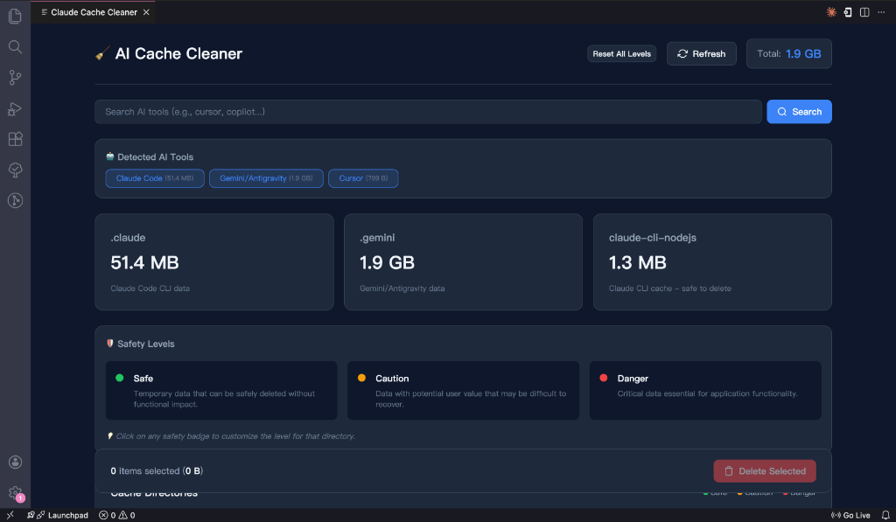

# AI Cache Cleaner

  

  <strong>A VSCode extension to visualize and clean cache from AI coding tools</strong>

---

## 🎯 Features

- **🔍 Auto-detect AI Tools** - Automatically finds Claude, Gemini, Cursor, Copilot, and more
- **🔎 Dynamic Search** - Search for any AI tool by name with progress indicator
- **🛡️ Safety Levels** - Scientific classification (Safe/Caution/Danger) with hover tooltips
- **⚙️ Customizable** - Click to change safety levels, persisted across sessions
- **🌙 Dark Mode** - Beautiful OLED-friendly dark theme
- **📊 Size Visualization** - See storage usage at a glance
- **📌 Activity Bar** - One-click access from the sidebar

## 📸 Screenshots

## 📖 Usage

1. Click the **AI Cache Cleaner** icon in the Activity Bar (left sidebar)
2. Or press `Cmd+Shift+P` (Mac) / `Ctrl+Shift+P` (Windows/Linux)
3. Type **"AI Cache Cleaner: Open Dashboard"**
4. Select directories to clean and click **Delete Selected**

### Safety Levels

| Level | Meaning | Action |
|-------|---------|--------|
| 🟢 **Safe** | Temporary data, auto-regenerates | Can delete freely |
| 🟡 **Caution** | May contain user data | Review before deleting |
| 🔴 **Danger** | Critical for functionality | Deletion blocked |

### Customizing Safety Levels

- **Hover** on a safety badge to see the scientific criteria
- **Click** on a badge to change its level
- Custom levels are **persisted** across sessions
- Use **Reset to Default** to restore original levels

## 🤖 Supported AI Tools

| Tool | Detected Locations |
|------|-------------------|
| Claude Code | `~/.claude/`, `~/Library/Caches/claude-cli-nodejs` |
| Gemini/Antigravity | `~/.gemini/` |
| Cursor | `~/.cursor/`, `~/Library/Application Support/Cursor` |
| GitHub Copilot | `~/.config/github-copilot` |
| Codeium | `~/.codeium/` |
| Continue | `~/.continue/` |
| Tabnine | `~/.tabnine/` |
| Amazon CodeWhisperer | `~/.aws/codewhisperer` |
| Sourcegraph Cody | `~/.cody/` |
| Windsurf | `~/.windsurf/` |

## 📄 License

This project is licensed under the MIT License.

---

  Made with ❤️ by <a href="https://github.com/lidegejingHk">lidegejingHk</a>

